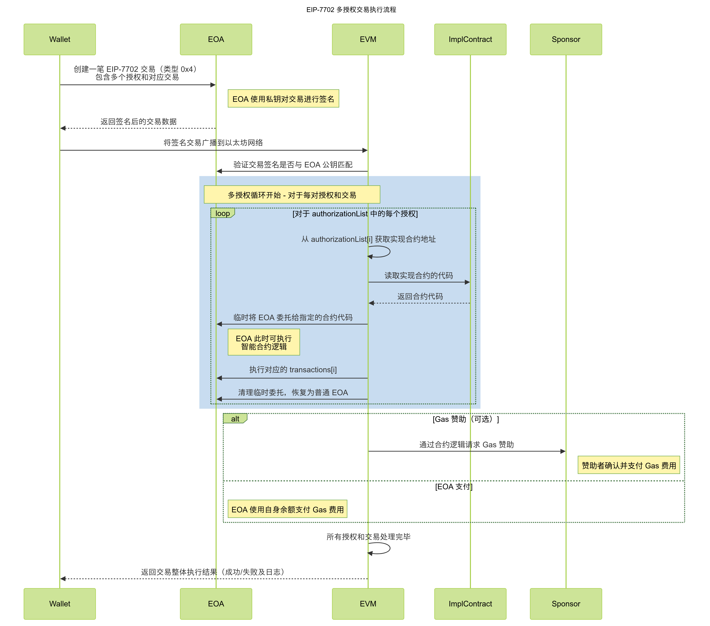

# BatchCallAndSponsor

一个教学性项目，展示使用EIP-7702进行账户抽象和赞助交易执行。本项目使用Foundry进行部署、脚本编写和测试。

Fork自：https://github.com/quiknode-labs/qn-guide-examples.git

文章参考：https://www.quicknode.com/guides/ethereum-development/smart-contracts/eip-7702-smart-accounts#anatomy-of-an-eip-7702-transaction

## 学习笔记
- [EIP-7702 多授权交易前端构建教程](./frontend-build.md)
- [EIP-7702 交易执行流程时序图](./sequence_diagram.md)
- [EIP-7702 后事件监听策略](./event.md)
- [Foundry 框架使用指南](./frontend-build.md)
- 清理DS_Store命令：find . -name ".DS_Store" -type f -delete




## 概述

`BatchCallAndSponsor`合约通过验证随机数和批量调用数据上的签名来实现批量执行调用。它支持：
- **直接执行**：由智能账户自身执行。
- **赞助执行**：通过链下签名（由赞助商完成）。

通过在每次批量执行后递增的内部随机数提供重放保护。

## 特点

- 批量交易执行
- 使用ECDSA的链下签名验证
- 通过随机数递增实现重放保护
- 支持ETH和ERC-20代币转账

## 前提条件

- [Foundry](https://github.com/foundry-rs/foundry)
- Solidity ^0.8.20

## 运行项目

### 步骤1：安装Foundry

```bash
curl -L https://foundry.paradigm.xyz | bash
git clone https://github.com/vsiryxm/EIP-7702-Study.git
cd EIP-7702-Study
```

### 步骤2：安装依赖包并创建remappings.txt

```bash
forge install OpenZeppelin/openzeppelin-contracts --no-commit
forge install foundry-rs/forge-std --no-commit
forge remappings > remappings.txt
```

### 步骤3：运行本地网络

在终端运行以下命令，启动具有Prague硬分叉的本地网络：

```bash
anvil --hardfork prague
```

### 步骤4：构建合约

在另一个终端，运行以下命令构建合约：

```bash
forge build
```

### 步骤5: 运行测试用例

构建合约后，运行以下命令执行测试用例。如果您想显示所有测试的堆栈跟踪，可以使用-vvvv标志代替`-vvv`：

```bash
forge test -vvv
```

输出应该如下所示：

```bash
Ran 4 tests for test/BatchCallAndSponsor.t.sol:BatchCallAndSponsorTest
[PASS] testDirectExecution() (gas: 128386)
Logs:
  Sending 1 ETH from Alice to Bob and transferring 100 tokens to Bob in a single transaction

[PASS] testReplayAttack() (gas: 114337)
Logs:
  Test replay attack: Reusing the same signature should revert.

[PASS] testSponsoredExecution() (gas: 110461)
Logs:
  Sending 1 ETH from Alice to a random address while the transaction is sponsored by Bob

[PASS] testWrongSignature() (gas: 37077)
Logs:
  Test wrong signature: Execution should revert with 'Invalid signature'.

Suite result: ok. 4 passed; 0 failed; 0 skipped;
```

#### 步骤6: 运行脚本

现在您已经设置好项目，是时候运行部署脚本了。该脚本部署合约、铸造代币，并测试批量执行和赞助执行功能。

我们使用以下命令：
- **`--broadcast`**: 将交易广播到您的本地网络。
- **`--rpc-url 127.0.0.1:8545`**: 连接到您的本地网络。
- **`--tc BatchCallAndSponsorScript`**: 指定脚本的目标合约。

```bash
source .env 

forge script ./script/BatchCallAndSponsor.s.sol --tc BatchCallAndSponsorScript --broadcast --rpc-url 127.0.0.1:8545

# 部署到 Sepolia
forge script ./script/BatchCallAndSponsor.s.sol --tc BatchCallAndSponsorScript --broadcast --rpc-url sepolia --verify
```

在 Sepolia 测试环境部署后输出如下所示：
```
forge script ./script/BatchCallAndSponsor.s.sol --tc BatchCallAndSponsorScript --broadcast --rpc-url sepolia
[⠊] Compiling...
No files changed, compilation skipped
Script ran successfully.

== Logs ==
  在测试网上使用配置账户:
  Alice地址: 0x1A8F1fb97beF9E4608a84B1ad708C1374DCA2666
  Bob地址: 0xCCF807B5207DC23Bc05fD547c55582B1C2E1F186
  实现合约已部署到: 0x7906B42019601bc580968cCe63db2f265967BFc0
  代币合约已部署到: 0x56E179f1AAab104528862226EF7aE2213523436D
  为Alice铸造了1000代币
  在测试网上跳过测试执行

## Setting up 1 EVM.

==========================

Chain 11155111

Estimated gas price: 10.093107666 gwei

Estimated total gas used for script: 1571771

Estimated amount required: 0.015864053929296486 ETH

==========================

##### sepolia
✅  [Success] Hash: 0x57345b05985fc4e9d3443d1c0ae26df9c7e8f7eff036777f5831b270776752e7
Contract Address: 0x56E179f1AAab104528862226EF7aE2213523436D
Block: 7941864
Paid: 0.002610207725180352 ETH (512556 gas * 5.092531792 gwei)


##### sepolia
✅  [Success] Hash: 0x7561c8832c0aa9cbf2ad7c1b1ff4a9efe0d3c36b4dea12ef49364efe98ae4f06
Block: 7941864
Paid: 0.000348471765462976 ETH (68428 gas * 5.092531792 gwei)


##### sepolia
✅  [Success] Hash: 0x9b045e5afe505025ebd28319a13c094dbcd72719e896f3edb1c69c9200b5f52a
Contract Address: 0x7906B42019601bc580968cCe63db2f265967BFc0
Block: 7941864
Paid: 0.003176700961722432 ETH (623796 gas * 5.092531792 gwei)

✅ Sequence #1 on sepolia | Total Paid: 0.00613538045236576 ETH (1204780 gas * avg 5.092531792 gwei)
                                                                                                      

==========================

ONCHAIN EXECUTION COMPLETE & SUCCESSFUL.

Transactions saved to: ~/workspace/ethproject/eip-7702-study/broadcast/BatchCallAndSponsor.s.sol/11155111/run-latest.json

Sensitive values saved to: ~/workspace/ethproject/eip-7702-study/cache/BatchCallAndSponsor.s.sol/11155111/run-latest.json
```

